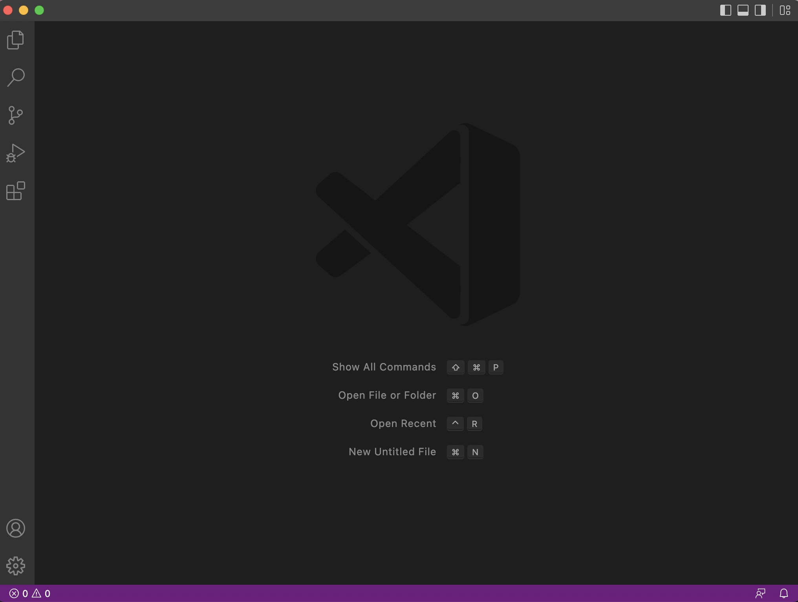
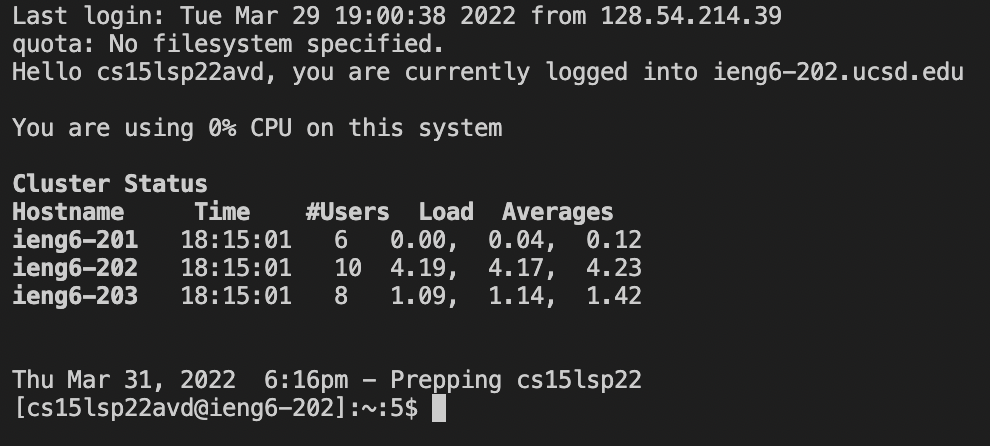
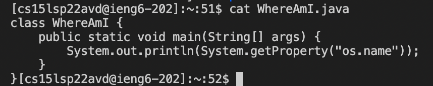
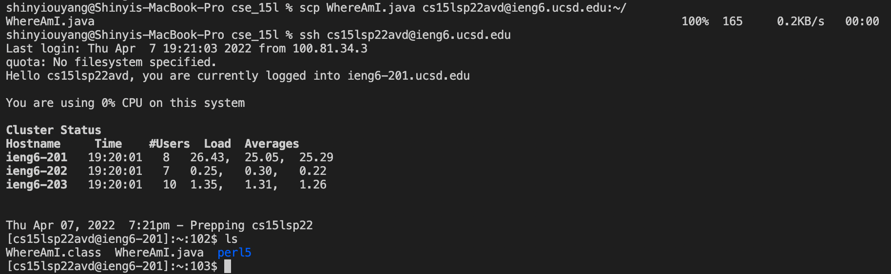
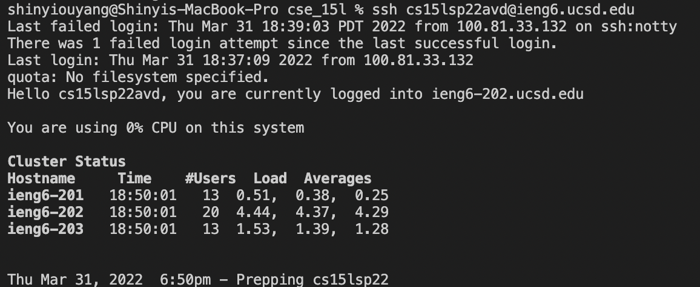
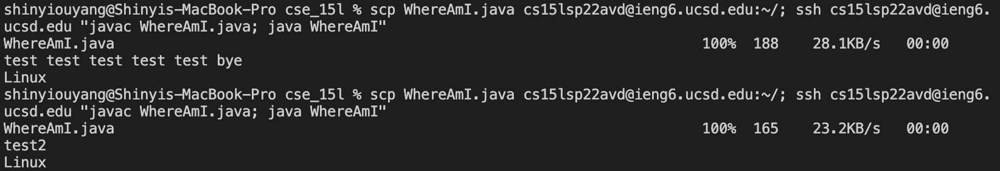

# Lab Report 1

In this lab report, I will be describing how to remotely access your cse 15L account on ieng6.
## Installing VScode
First, it is highly recommended to install VScode.

Go to https://code.visualstudio.com to install VScode on your computer.

Once you have installed VScode, VScode should look like this:

## Remotely Connecting
First, open up the terminal by pressing ``Ctrl + ` ``

Then, type ``ssh cs15lsp22avd@ieng6.ucsd.edu`` where "avd" is replaced with your account-specific letters.

You will be prompted to enter your password. Once you enter your password, you should be greeted with something like this:

## Trying Some Commands
Once you have access to the remote computer, try some commands! 

Here's what I got when I used the `cat` commands

## Moving Files with scp
To move files to the remote computer, we have to use the `scp` command.

To use the scp command, type `scp _filename_ cs15lsp22avd@ieng6.ucsd.edu:~/` where `_filename_` is replaced with the actual filename and "avd" is replaced with your account-specific letters.

For example, to transfer the `WhereAmI.java` file, type `scp WhereAmI.java cs15lsp22avd@ieng6.ucsd.edu:~/`

## Setting an SSH Key
Typing your password everytime you ssh is annoying. Ssh-keygen lets us get around this problem.

Use ssh-keygen on your computer to create the public/private keys on your computer. Then use scp to tranfer the _public_ key to the .ssh folder of your user account on the server.

If you have everything set up properly, you should be able to get in without a password!

## Optimizing Remote Running
Using sshkeygen and chaining terminal commands together, you can very quickly transfer files over to the server. 

Here is what that looks like:

As you can see, I only have to use one command after I edit a file locally to transfer my editted file to the remote server.

Thanks for reading!

---