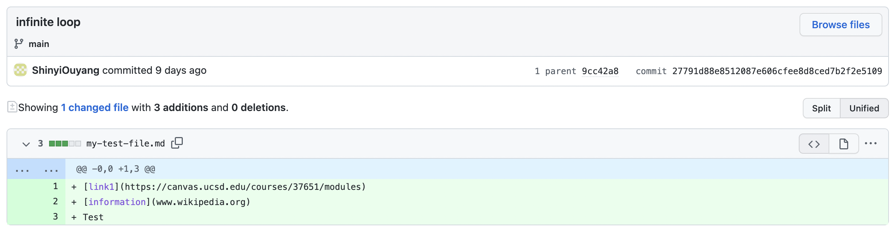
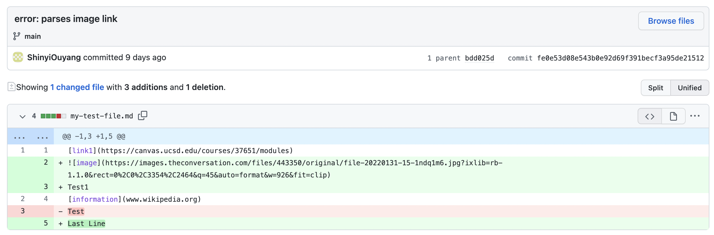
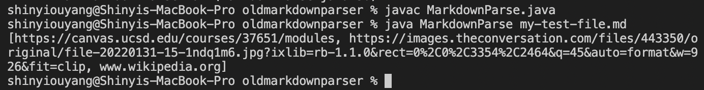
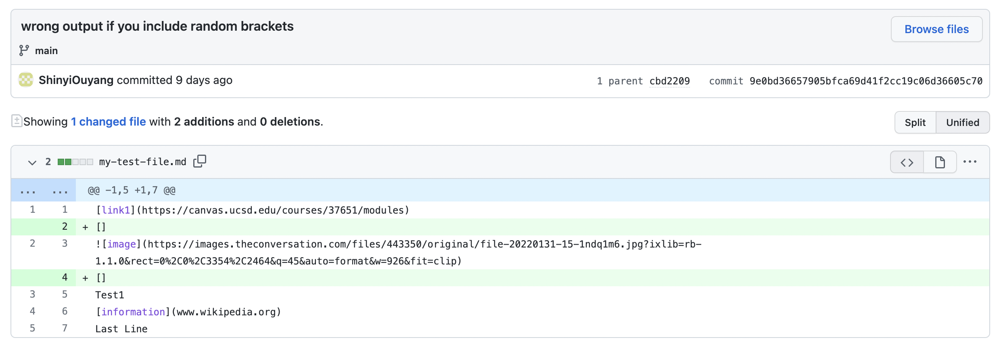
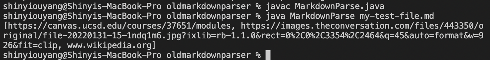

# Lab Report 2

In this lab report I will show you 3 bugs that existed in the markdown parser program, show the symptoms of these bugs, and explain why these symptoms occured.

I used the same [test file](https://github.com/ShinyiOuyang/markdown-parser/blob/main/my-test-file.md) for all three bugs, so I will link to the different github commit diff pages. Also I forgot to include the symptom outputs in my original commit messages. 

## Infinite Loop Bug

[Commit Diff Link](https://github.com/ShinyiOuyang/markdown-parser/commit/27791d88e8512087e606cfee8d8ced7b2f2e5109)



The markdown parse program has a while-loop that continues looping if currentIndex is less than the length of the page. CurrentIndex is set to 1 greater than the index of the closing parentheses. 

What this means is if the md file does not end with a closing parentheses, the program will infinitely loop because the while-loop can never end.

As you can see in my faulty input, my md file ends with "Test" rather than a closing parantheses. 

## Parsing Image Link Bug
[Commit Diff Link](https://github.com/ShinyiOuyang/markdown-parser/commit/fe0e53d08e543b0e92d69f391becf3a95de21512)





For md files, to create links, you write ``[text of link](link url)`` and to create images, you write ````. They are very similar, aside from that exclamation mark.

When my markdown parser sees the brackets and parantheses of images, the parser thinks it is seeing a link url, when it is actually seeing an image url. Because of this, it adds the image url to the output.

In my faulty input file, we included an image which is interpreted as a link.

## Bracket Bug

[Commit Diff Link](https://github.com/ShinyiOuyang/markdown-parser/commit/9e0bd36657905bfca69d41f2cc19c06d36605c70)





When my markdown parser finds the index of brackets and parantheses, it does not care if the brackets or parantheses are right next to each other not. 

To detect images, my markdown parser checks if there is an exclamation mark immedietely to the right of the opening bracket. However, when random brackets are included in the md file, my markdown parser believes the opening brackets of the image are somewhere else. My markdown parser will then interpret the image url as a link url, so it adds this image url to the output.

In my faulty input file, we included random brackets in a line above the image link. 

Thanks again for reading!