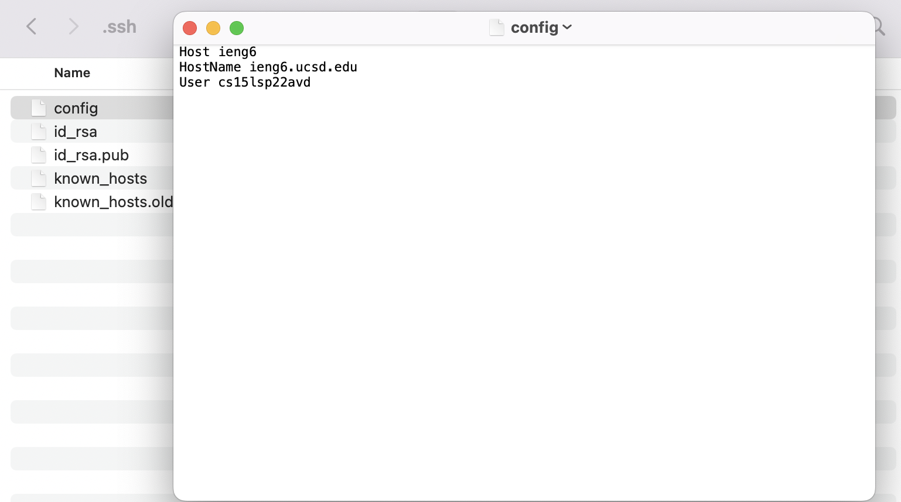
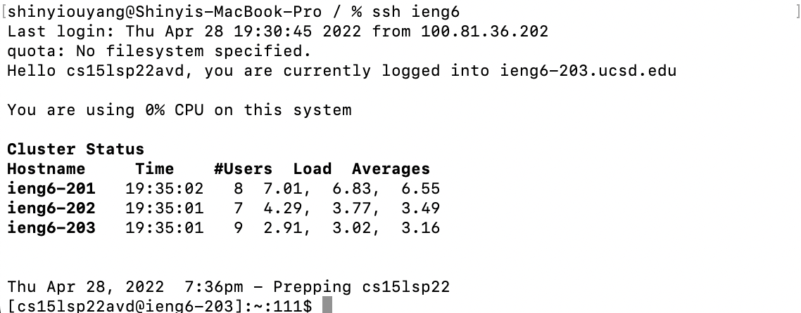
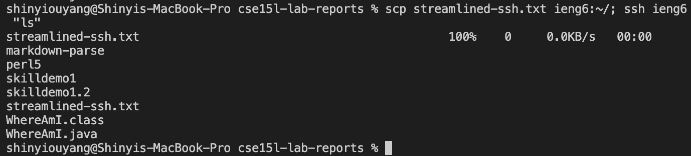
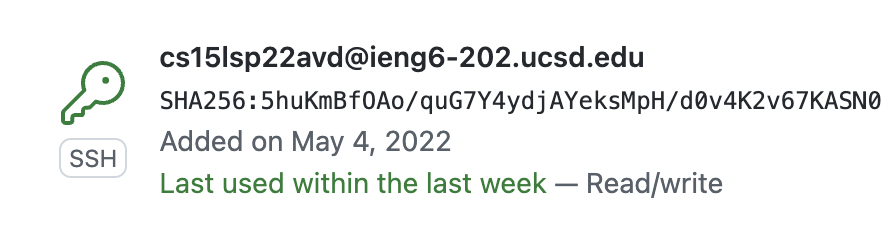
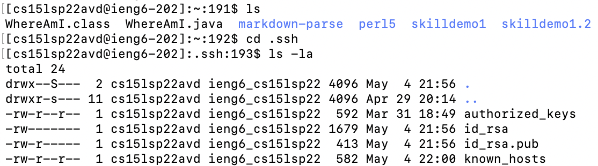
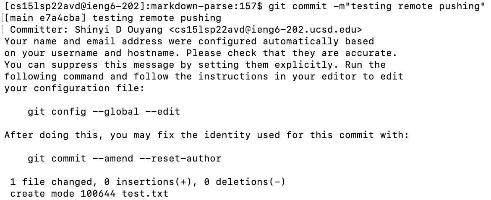
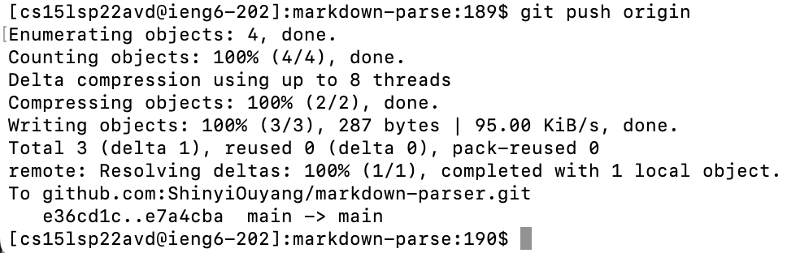
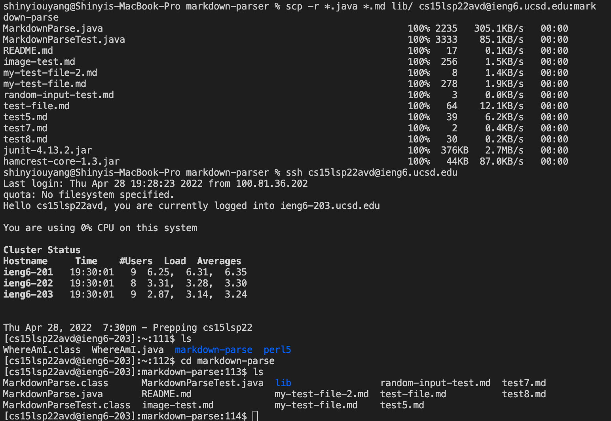
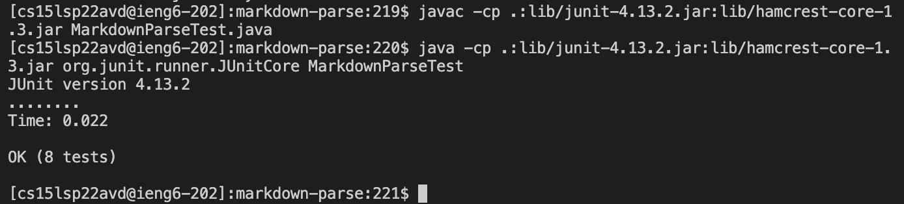
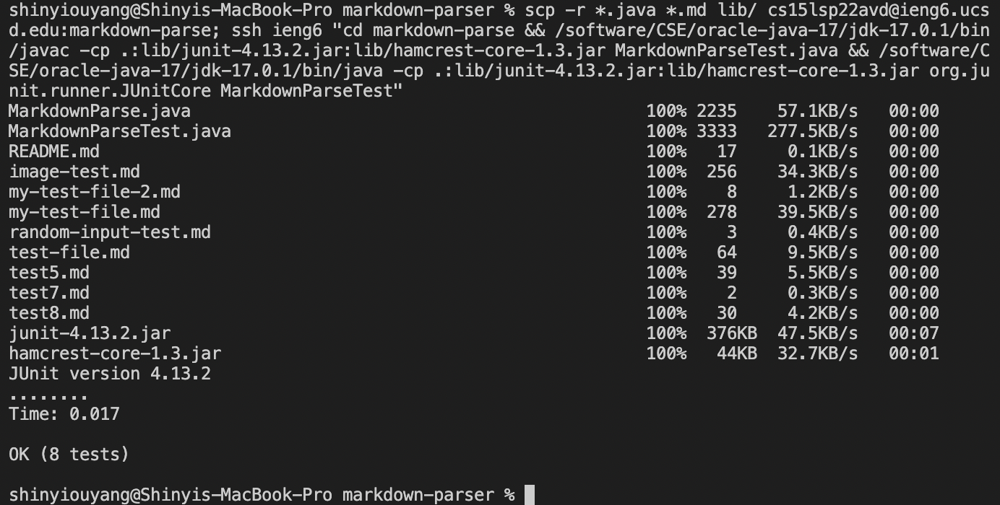

# Lab Report 3
In this lab report I will be showing my implementation of all three group choice options from lab 5.

## Streamlining ssh Configuration
I opened up the ssh config file with text edit. Modifying the ssh config file will allow me to type ``ssh ieng6`` to get into my ieng6 account.

Here's an example of me ssh-ing into my ieng6 using this new alias.

Here's an example of me scp-ing to my ieng6 using this alias.

## Setup Github Access from ieng6
To set up github access, we use ssh-keygen to generate a new ssh key on my ieng6 account. We then give GitHub the public key. Here's what the public key looks like in my GitHub Settings

In the .ssh folder on ieng6, we have both the public key and the private key

We can now remotely push to git from ieng6! [Here](https://github.com/ShinyiOuyang/markdown-parser/commit/e7a4cba0bf6ab40532b88540560558f47b98d506) is the link to the commit I made.

## Copy whole directories with scp

I used ``scp -r`` to copy my entier MarkdownParser folder to ieng6.

In the following screenshot I then compile and run the tests in the MarkdownParser folder that I just transfered over.

Finally, we can type this really long command to scp, ssh, and then run the junit tests, all in a single command.

Thanks for reading!