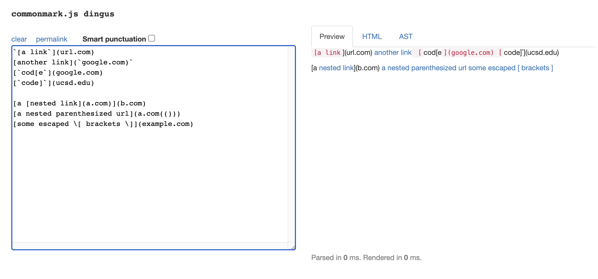
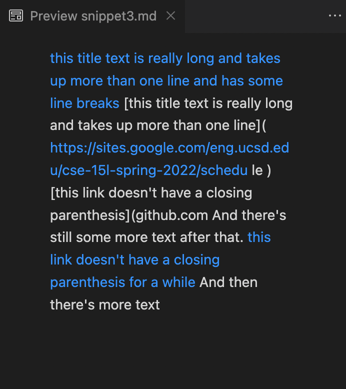
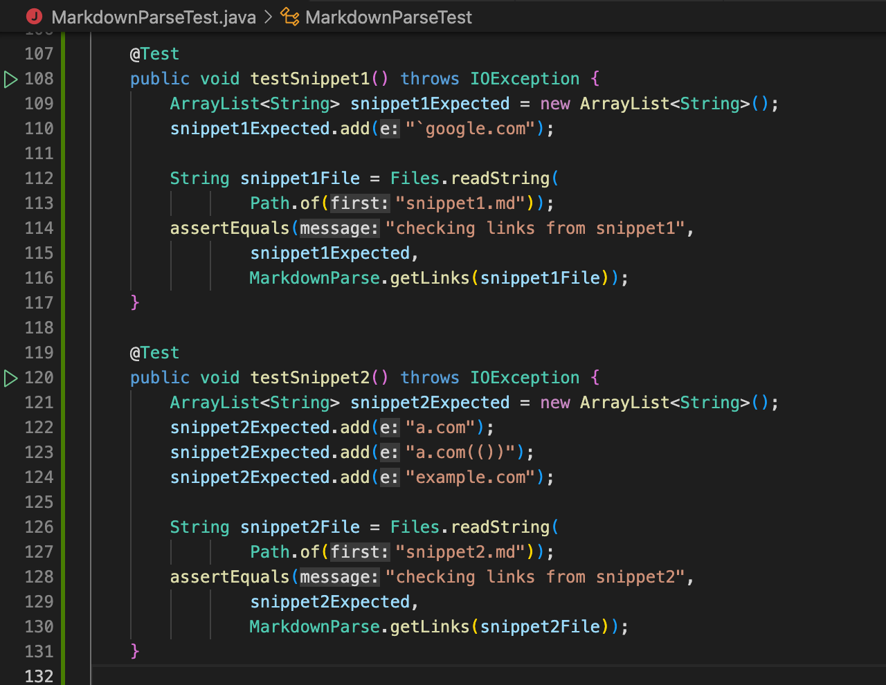
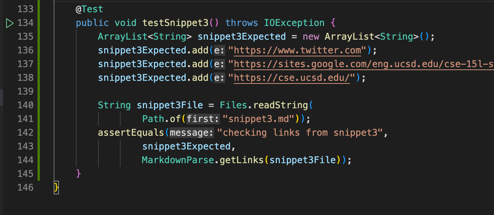
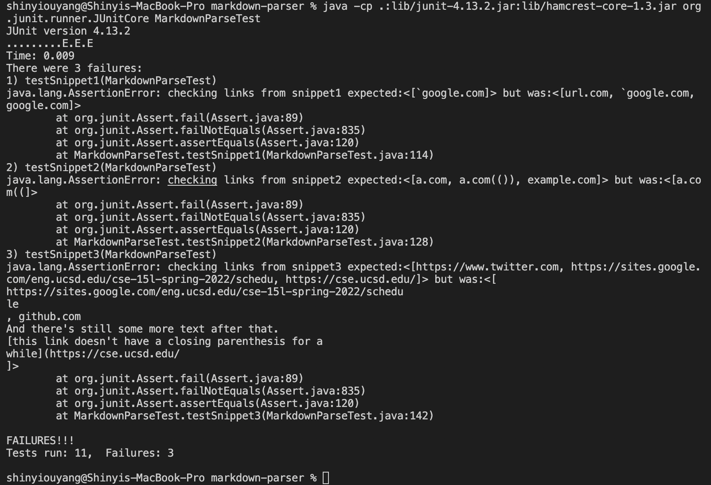
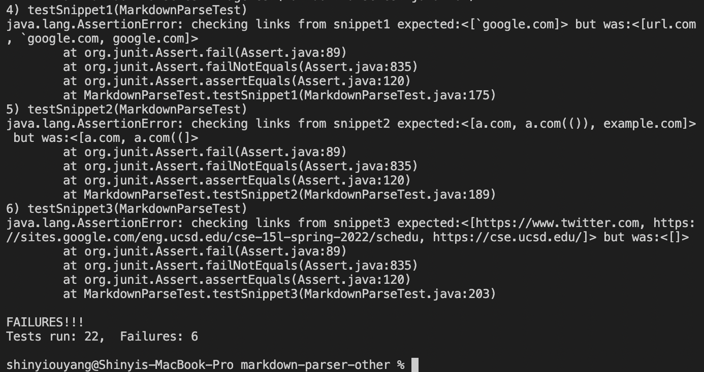

# Lab Report 4

# Links:
https://github.com/ShinyiOuyang/markdown-parser

https://github.com/kaileywong/markdown-parser

# Tests:
I got conflicting results on the expected output on snippet 3.

My implementation of tests on snippets:

Output of tests on my MarkdownParse:

Output of tests on reviewed Markdownparse:

# Snippet #1

I believe I could fix this with a small code fix. I would need a variable to check if a backtick is called before a bracket. Anytime there is a backtick, I set `existsBacktick = !existsBacktick`. If the program sees a opening bracket when existsBacktick is true, I just ignore the link. 

# Snippet #1

I believe I could fix this with a small code fix. I would need a variable to check if a backtick is called before a bracket. Anytime there is a backtick, I set `existsBacktick = !existsBacktick`. If the program sees a opening bracket when existsBacktick is true, I just ignore the link. 

# Snippet #2

I believe fixing this would require something more complicated. For the escaped brackets, just like the exclamation marks, I would check if there was a backlash before the bracket. However, I would need to change how my code finds the substring between the opening the closing parantheses. I'm not sure what would happen if there were an unbalanced number of nested parantheses. 

# Snippet #3

I think fixing this could require a simple fix but I'm not confident. First, I would need to check for newlines in the substring between opening and closing parentheses. Then, if I fail to find a link, instead of trying to search for a new link after the index of the closing parentheses, I would start looking at the end of the opening parantheses. I'm not sure what would happen if this was combined with a situation like in snippet #2.
