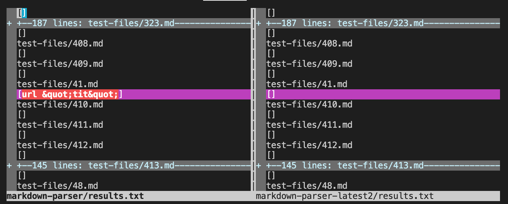

# Lab Report 5

## How I found Test Results

To find the tests with different results, I ran vimdiff on the result of running a bash for loop

[Here](https://github.com/ShinyiOuyang/markdown-parser/blob/main/test-files/201.md) is the link to test file 201.

[Here](https://github.com/ShinyiOuyang/markdown-parser/blob/main/test-files/41.md) is the link to test file 41.

# Test 1

For test 201, my implementation of markdown parser is correct while the provided implementation is wrong.

## What is the cause of the bug?

The other implementation does not check the content in between the closing bracket and opening parantheses. The parser should not add the link if there is a <> in between.

# Test 2

For test 41, my implementation of markdown parser is wrong, while the provided implementation is right.

## What is the cause of the bug?

My implementation does not check the content of the links. My implementation should check for spaces in the link and not add the link if there is a space.

Thanks for reading!